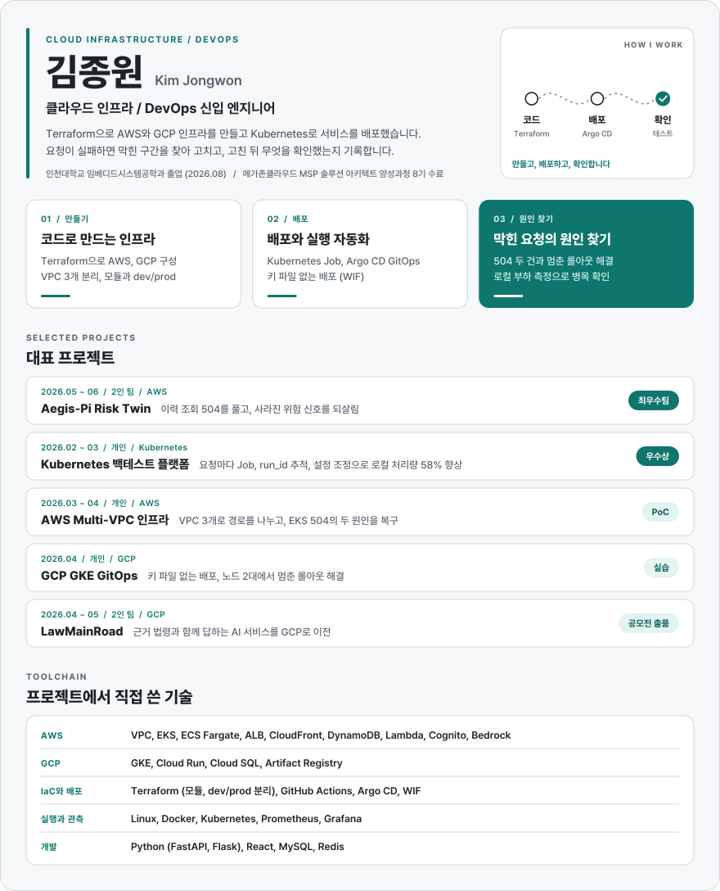

  <a href="https://kjw-cloud-portfolio.vercel.app">
    <picture>
      <source media="(max-width: 600px) and (prefers-color-scheme: dark)" srcset="./assets/profile-mobile-dark.svg" />
      <source media="(max-width: 600px)" srcset="./assets/profile-mobile-light.svg" />
      <source media="(prefers-color-scheme: dark)" srcset="./assets/profile-desktop-dark.svg" />
      
    </picture>
  </a>

  <a href="https://kjw-cloud-portfolio.vercel.app"><picture><source media="(prefers-color-scheme: dark)" srcset="./assets/contact-portfolio-dark.svg" /></picture></a>
  <a href="https://kjw-cloud-portfolio.vercel.app/resume"><picture><source media="(prefers-color-scheme: dark)" srcset="./assets/contact-resume-dark.svg" /></picture></a>
  <a href="mailto:jowon7602@gmail.com"><picture><source media="(prefers-color-scheme: dark)" srcset="./assets/contact-email-dark.svg" /></picture></a>

<b>텍스트로 보기와 저장소 링크</b>

 

**김종원** | 클라우드 인프라 / DevOps 신입 엔지니어

Terraform으로 AWS와 GCP 인프라를 만들고 Kubernetes로 서비스를 배포했습니다. 요청이 실패하면 막힌 구간을 찾아 고치고, 고친 뒤 무엇을 확인했는지 기록합니다.

**대표 프로젝트**

- [Aegis-Pi Risk Twin 개인 구현 저장소](https://github.com/aegis-pi/dashboard_vpc): 2인 팀, MSP 최종 프로젝트 최우수팀(팀). 데이터/대시보드 VPC와 관제 화면을 맡아 이력 조회 504를 풀고, 사라진 위험 신호를 되살렸습니다. 이력 조회 테스트 38개를 다시 실행해 통과했고, 응답 시간은 재지 않았습니다.
- [Kubernetes 백테스트 플랫폼](https://github.com/JJong-03/stock-backtest-platform): 개인, MSP 개인 프로젝트 우수상. 요청마다 Kubernetes Job을 띄우고 run_id로 추적했습니다. 로컬 kind 1노드 부하 측정 뒤 웹 워커 2개, CPU 1코어, 메모리 1Gi로 바꿔 처리량이 분당 27.7건에서 43.7건으로 늘었습니다(구성별 1회 측정).
- [AWS Multi-VPC 인프라](https://github.com/JJong-03/aws-terraform-multi-vpc): 개인 PoC. VPC 3개로 사용자, 관리자, 서비스 경로를 나누고, EKS로 가는 요청의 504를 보안 그룹과 호출 주소 두 원인으로 나눠 복구했습니다.
- [GCP GKE GitOps](https://github.com/JJong-03/gcp-gke-gitops-pipeline): 개인 실습. 키 파일 없이 WIF로 이미지를 올리고, 노드 2대에서 멈춘 롤아웃을 교체 순서를 바꿔 끝냈습니다.
- [LawMainRoad 메인 저장소](https://github.com/2026-moel-datacontest-core/law_main_road_main): 2인 팀, 고용노동 공공데이터 활용 공모전 출품. 사후 대응 기능과 GCP 이전을 맡았습니다. 60문항 자체 평가에서 충족 44, 부분 충족 16, 실패 0(2026-04-20)이었습니다.

**직접 쓴 기술**: AWS (VPC, EKS, ECS Fargate, ALB, CloudFront, DynamoDB, Lambda, Cognito, Bedrock), GCP (GKE, Cloud Run, Cloud SQL, Artifact Registry), Terraform, GitHub Actions, Argo CD, WIF, Linux, Docker, Kubernetes, Prometheus, Grafana, Python (FastAPI, Flask), React, MySQL, Redis

**그 밖의 경험**: [Terraform 모듈 리팩터링](https://github.com/JJong-03/aws-terraform-deepdive)(교육 미션 선택 심화), [얼굴 추적 로봇팔](https://github.com/JJong-03/face-tracking-robot-arm)(졸업작품 4인 팀 팀장, 정보기술대학장 장려상, 팀), [청각 보조 헤드셋](https://github.com/JJong-03/hearing-assist-headset-archive)(창업경진대회 5인 팀, 학장상, 팀)

**학력과 교육**: 인천대학교 임베디드시스템공학과 졸업(2026.08), 메가존클라우드 MSP 솔루션 아키텍트 양성과정 8기 수료

카드 이미지는 `scripts/build_profile_assets.py`로 만듭니다.

