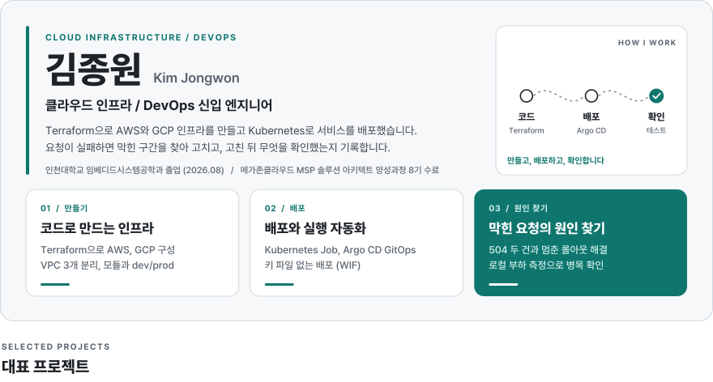
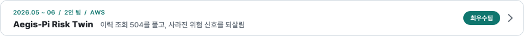
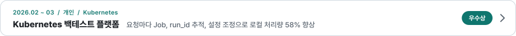
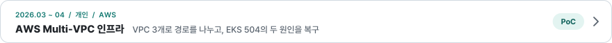
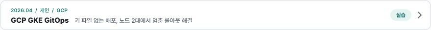
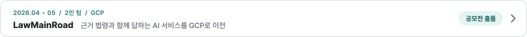
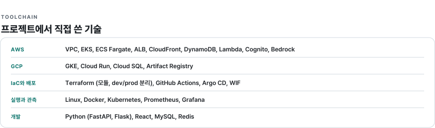

<!-- Generated by scripts/build_profile_assets.py. Edit the script, not this file. -->

  <a href="https://kjw-cloud-portfolio.vercel.app"><picture><source media="(max-width: 600px) and (prefers-color-scheme: dark)" srcset="./assets/header-mobile-dark.svg" /><source media="(max-width: 600px)" srcset="./assets/header-mobile-light.svg" /><source media="(prefers-color-scheme: dark)" srcset="./assets/header-desktop-dark.svg" /></picture></a>
  <a href="https://kjw-cloud-portfolio.vercel.app/projects/aegis-pi-risk-twin"><picture><source media="(max-width: 600px) and (prefers-color-scheme: dark)" srcset="./assets/project-aegis-mobile-dark.svg" /><source media="(max-width: 600px)" srcset="./assets/project-aegis-mobile-light.svg" /><source media="(prefers-color-scheme: dark)" srcset="./assets/project-aegis-desktop-dark.svg" /></picture></a>
  <a href="https://kjw-cloud-portfolio.vercel.app/projects/stock-backtest-platform"><picture><source media="(max-width: 600px) and (prefers-color-scheme: dark)" srcset="./assets/project-stock-mobile-dark.svg" /><source media="(max-width: 600px)" srcset="./assets/project-stock-mobile-light.svg" /><source media="(prefers-color-scheme: dark)" srcset="./assets/project-stock-desktop-dark.svg" /></picture></a>
  <a href="https://kjw-cloud-portfolio.vercel.app/projects/aws-terraform-multi-vpc"><picture><source media="(max-width: 600px) and (prefers-color-scheme: dark)" srcset="./assets/project-multivpc-mobile-dark.svg" /><source media="(max-width: 600px)" srcset="./assets/project-multivpc-mobile-light.svg" /><source media="(prefers-color-scheme: dark)" srcset="./assets/project-multivpc-desktop-dark.svg" /></picture></a>
  <a href="https://kjw-cloud-portfolio.vercel.app/projects/gcp-gke-gitops-pipeline"><picture><source media="(max-width: 600px) and (prefers-color-scheme: dark)" srcset="./assets/project-gke-mobile-dark.svg" /><source media="(max-width: 600px)" srcset="./assets/project-gke-mobile-light.svg" /><source media="(prefers-color-scheme: dark)" srcset="./assets/project-gke-desktop-dark.svg" /></picture></a>
  <a href="https://kjw-cloud-portfolio.vercel.app/projects/law-main-road"><picture><source media="(max-width: 600px) and (prefers-color-scheme: dark)" srcset="./assets/project-lawmainroad-mobile-dark.svg" /><source media="(max-width: 600px)" srcset="./assets/project-lawmainroad-mobile-light.svg" /><source media="(prefers-color-scheme: dark)" srcset="./assets/project-lawmainroad-desktop-dark.svg" /></picture></a>
  <picture><source media="(max-width: 600px) and (prefers-color-scheme: dark)" srcset="./assets/tools-mobile-dark.svg" /><source media="(max-width: 600px)" srcset="./assets/tools-mobile-light.svg" /><source media="(prefers-color-scheme: dark)" srcset="./assets/tools-desktop-dark.svg" /></picture>

  <a href="https://kjw-cloud-portfolio.vercel.app"><picture><source media="(prefers-color-scheme: dark)" srcset="./assets/contact-portfolio-dark.svg" /></picture></a>
  <a href="https://kjw-cloud-portfolio.vercel.app/resume"><picture><source media="(prefers-color-scheme: dark)" srcset="./assets/contact-resume-dark.svg" /></picture></a>
  <a href="mailto:jowon7602@gmail.com"><picture><source media="(prefers-color-scheme: dark)" srcset="./assets/contact-email-dark.svg" /></picture></a>

